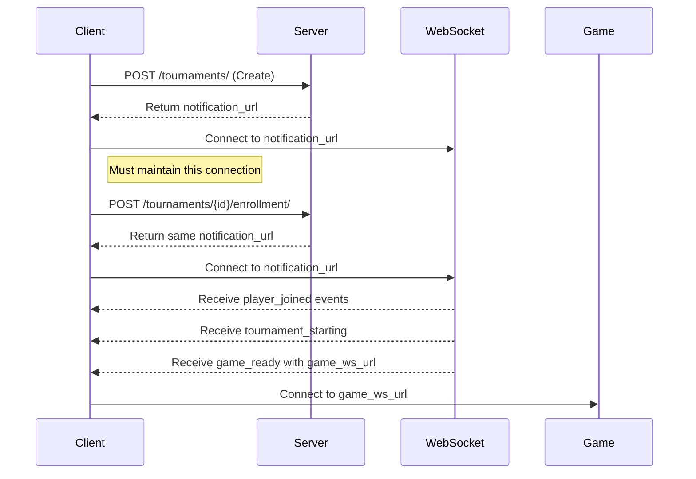

# Tournament System Workflow Documentation

## ⚠️ IMPORTANT: WebSocket Notification System
Before implementing any tournament functionality, understand that the tournament system operates through a WebSocket-based notification system. You **must** connect to the notification channel to:
- Receive tournament updates
- Get game assignments
- Know when to start playing
- Receive opponent information

### Essential Notification Flow
1. Create/Join Tournament → Get WebSocket URL
2. Connect to WebSocket → Receive Real-time Updates
3. Listen for Game Ready → Connect to Game



### Important Notification Types You'll Receive
```json
{
    "player_joined": "New player joined tournament",
    "player_left": "Player left tournament",
    "game_ready": {
        "game_id": "uuid",
        "ws_url": "ws/game/{id}/",
        "player_id": "your_id"
    },
    "waiting_opponent": "Waiting for next round",
    "tournament_complete": "Tournament finished"
}
```

## Standard Workflow

### 1. Creating a Tournament
```http
POST /all_tournaments/
{
    "name": "Tournament Name",
    "startingDate": "2024-12-20T15:00:00",
    "registrationStart": "2024-12-19T15:00:00",
    "registrationClose": "2024-12-20T14:00:00",
    "type": "single_elimination",
    "visibility": "public",
    "min_participants": 2,
    "max_participants": 4
}

Response:
{
    "status": "success",
    "tournament_notification_url": "ws/tournament/{id}/",
    "message": "Tournament created and enrolled"
}
```

### 2. Joining a Tournament
```http
POST /tournaments/{id}/enrollment/

Response:
{
    "status": true,
    "tournament_notification_url": "ws/tournament/{id}/",
    "tournament_starting": false
}
```

### 3. WebSocket Connection Example
```python
# Connect to tournament notifications
websocket = await connect(f"ws/tournament/{tournament_id}/")

# Listen for updates
while True:
    msg = await websocket.recv()
    data = json.loads(msg)
    
    if data["type"] == "game_ready":
        # Connect to actual game
        game_socket = await connect(data["ws_url"])
        break
    elif data["type"] == "player_joined":
        print(f"New player: {data['username']}")
    elif data["type"] == "waiting_opponent":
        print("Waiting for next round...")
```

## Detailed Component Documentation

### Tournament Manager
- Handles tournament creation and management
- Manages player enrollment
- Creates and schedules tournament games
- Supports different tournament types (single elimination, round robin)

### Tournament Types Support
1. **Single Elimination**
   - Bracket-based tournament
   - Winners advance to next round
   - Automatic progression handling

2. **Round Robin**
   - All players play against each other
   - Points-based ranking system
   - Complete schedule created at start

### Game Coordinator
- Creates and manages individual games
- Handles player assignments
- Manages game states and transitions

## Error Handling
1. **WebSocket Connection Errors**
   - 4001: Not authenticated
   - 4003: Not enrolled in tournament
   - 4008: Force disconnect (player left)

2. **API Errors**
   - Tournament full
   - Player already enrolled
   - Not authorized for private tournament
   - Tournament already started

## Monitoring
1. **Tournament Schedule**
   ```http
   GET /tournaments/{id}/schedule/
   ```

2. **Tournament Status**
   - All updates come through WebSocket
   - No need to poll endpoints

## Security
- All endpoints require authentication
- WebSocket connections validate user session
- Private tournaments verify allowed players
- Redis locks prevent race conditions

## Development Tips
1. Always maintain WebSocket connection
2. Handle reconnection scenarios
3. Process notifications in order
4. Verify game connections before disconnecting tournament WebSocket
