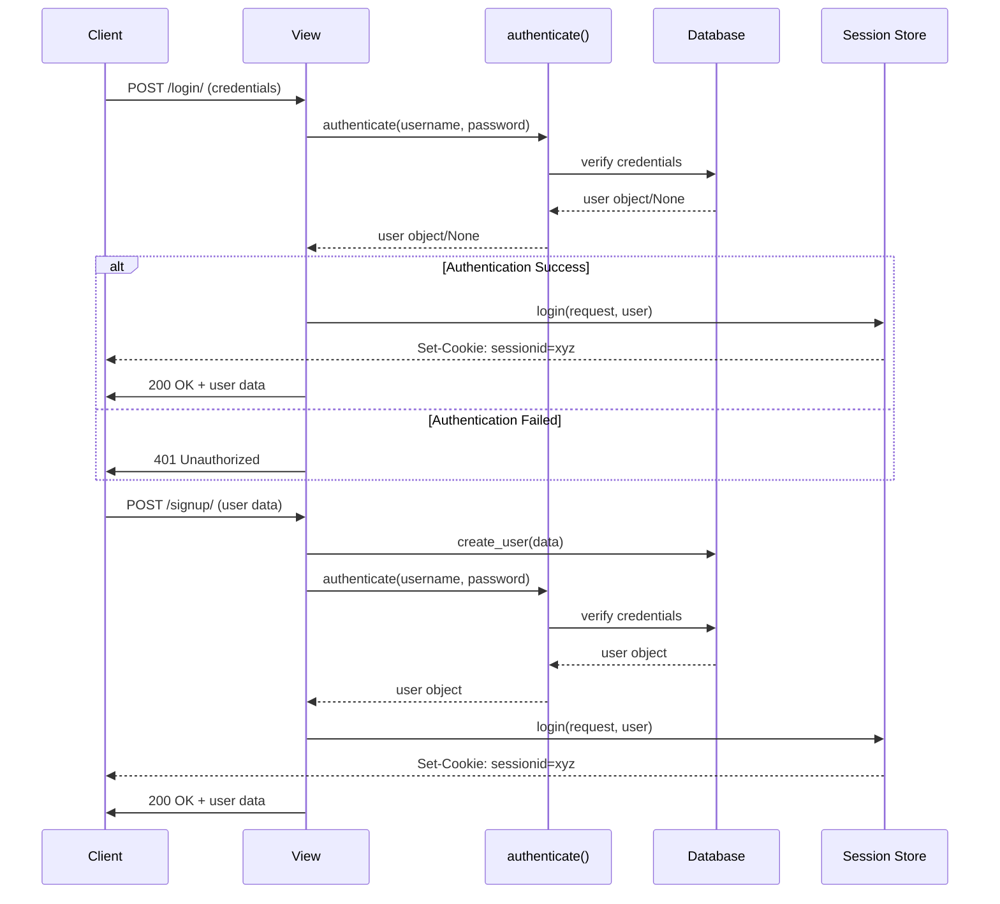

# Authentication in Django: Built-in Session Management vs. JWT with Easy JWT

## 1. **Django Built-in Session Management**

### Overview

Django's built-in session management uses server-side session storage combined with cookies to track user sessions. The session ID is stored in a cookie, and the server retains session data in the database, file storage, or cache.

### Key Features

- **Stateful Authentication:** User session data is stored on the server.
- **Session Cookies:** A session cookie is sent to the client to identify the user session.
- **CSRF Protection:** Built-in CSRF tokens are automatically managed for secure form submissions.
- **Built-in Integration:** Django provides out-of-the-box tools for user authentication, login/logout views, and decorators.

### Pros

- **Secure by Design:** Session data is stored server-side, reducing the risk of client tampering.
- **Tightly Integrated:** Works seamlessly with Django’s user model and authentication views.
- **CSRF Protection:** Integrated into Django's middleware for secure requests.
- **Simpler Setup:** Minimal configuration is needed since it is a core Django feature.

### Cons

- **Server Load:** Session data is stored on the server, which can increase resource usage as the number of users grows.
- **Scalability Challenges:** Scaling requires syncing session data across servers or using shared storage (e.g., Redis).
- **Less Decoupled:** Tightly coupled with Django, making it less suitable for multi-client applications (e.g., mobile apps).

### Current Implementation Breakdown

#### Backend Authentication Functions

The current implementation uses Django's built-in authentication system with these key functions:



1. **`authenticate(request, username, password)`** (from `django.contrib.auth`)::
   - Verifies user credentials against the database
   - Returns a User object if credentials are valid, None otherwise
   - Used in both login and signup views:

```python
user = authenticate(request, username=username, password=password)
if user is not None:
    login(request, user)  # This creates the session for the new user
```

2. **`login(request, user)`**:
   - Creates a session for the authenticated user
   - Stores session ID in database
   - Automatically sends session cookie to client
   - Used after successful authentication:

```python
if user is not None:
    login(request, user)  # Login and create session
```

3. **`logout(request)`**:
   - Invalidates the user's session
   - Clears session data from database
   - Removes session cookie from client
   - Used in logout view:

```python
logout(request)
```

#### Decorators

1. **`@method_decorator(csrf_exempt)`**:

   - Disables CSRF protection for specific views
   - Currently used on all auth views for API access
   - Would be removed with JWT as tokens handle security

2. **`@login_required`**:
   - Verifies session authentication
   - Redirects unauthenticated users
   - Used in protected views:

```python
from django.contrib.auth.decorators import login_required
```

#### Frontend Handling

The frontend is simplified due to session-based authentication:

1. **Automatic Cookie Management**:

   - No manual token handling required
   - Browser automatically sends session cookie
   - No Authorization headers needed

2. **Simple Auth State Management**:
   - Only stores user info in localStorage
   - No token management code
   - Session handled automatically by browser

#### What Would Change with JWT

1. **Backend Changes**:
   - Remove session middleware
   - Remove `login()` and `logout()` functions
   - Replace `authenticate()` with JWT token generation
   - Remove `@login_required` decorator
   - Keep `CustomUser` model and `refresh_token_hash` field:

```python
# Stores a hashed version of the user's refresh token.
# Refresh tokens allow the user to get a new access token after the
# initial one expires, without needing to re-authenticate. This field
# stores a secure hash of the refresh token for validation when the user
# requests a new access token. Keeping the hash instead of the raw token
# ensures that sensitive data is not stored directly in the database.
refresh_token_hash = models.CharField(max_length=64, null=True, blank=True)
```

2. **Frontend Changes**:
   - Add token storage in localStorage
   - Add Authorization headers to requests
   - Implement token refresh logic
   - Update auth service to handle tokens
   - Keep current success/error handling logic:

```javascript
const result = await response.json();
if (!response.ok) {
  throw new Error(result.error || "Authentication failed");
}
return result;
```

This breakdown shows how the current session-based authentication is deeply integrated with Django's built-in features, making it simpler to implement but less flexible for modern web applications. The transition to JWT would require more manual handling but provide better scalability and client flexibility.

## 2. **JWT Authentication with Easy JWT (No Django Rest Framework)**

### Overview

JWT is a stateless authentication mechanism where the server issues a signed token to the client upon login. The client includes this token in subsequent requests for authentication.

### Key Features

- **Stateless Authentication:** No session data is stored on the server.
- **Compact Tokens:** JWTs contain all necessary information (e.g., user ID, roles) and are signed to ensure authenticity.
- **Frontend Storage:** Tokens are typically stored in `localStorage` or `sessionStorage` on the client.

### Pros

- **Stateless Scalability:** No server-side session storage makes scaling easier.
- **Decoupling:** Can be used across different frontend clients (e.g., mobile apps, SPAs).
- **Flexibility:** Allows for granular token payload customization (e.g., roles, permissions).
- **Simplified Deployment:** Works well in distributed systems without the need for shared session storage.

### Cons

- **Security Risks:** Tokens stored in `localStorage` or `sessionStorage` can be vulnerable to XSS attacks. Storing them in cookies mitigates this but reintroduces some server dependency.
- **Complexity:** Requires manual setup of authentication flows (login, refresh, logout) without Django Rest Framework.
- **No Built-in CSRF Protection:** Additional measures are required to prevent CSRF attacks if tokens are stored in cookies.
- **Token Revocation:** Token invalidation requires implementing a blacklist or token expiration strategy.

---

## **Comparison Table**

| Feature                 | Django Built-in Session Management           | JWT with Easy JWT                                          |
| ----------------------- | -------------------------------------------- | ---------------------------------------------------------- |
| **Authentication Type** | Stateful                                     | Stateless                                                  |
| **Data Storage**        | Server-side (database, file, or cache)       | Client-side (`localStorage`, `sessionStorage`, or cookies) |
| **Scalability**         | Requires shared session storage for scaling  | Easily scalable (no server storage)                        |
| **Security**            | Server-stored data, CSRF protection included | Vulnerable to XSS, no CSRF protection by default           |
| **Ease of Use**         | Integrated with Django, minimal setup        | Requires manual setup of auth flows                        |
| **Flexibility**         | Limited to Django views and session system   | Usable with multiple clients (e.g., mobile)                |
| **Revocation**          | Immediate session invalidation supported     | Requires token revocation strategy                         |
| **Setup Complexity**    | Low                                          | Moderate                                                   |

---

## **When to Use Which?**

### Use Django Built-in Session Management:

- If your app primarily serves web clients using Django views or templates.
- When ease of setup and tight integration with Django's ecosystem is preferred.
- If CSRF protection and secure session handling are priorities.

### Use JWT with Easy JWT:

- If your app needs to support multiple clients (e.g., mobile apps, SPAs).
- When you want to avoid server-side session storage for scalability.
- If you need a stateless authentication system with token-based flexibility.

---

## **Conclusion**

Both Django's built-in session management and JWT with Easy JWT have their strengths and weaknesses. The choice depends on your application's architecture, scalability requirements, and security considerations. For traditional web applications, Django's session management is often more straightforward. For SPAs or multi-client apps, JWT provides the necessary flexibility at the cost of additional setup complexity.
